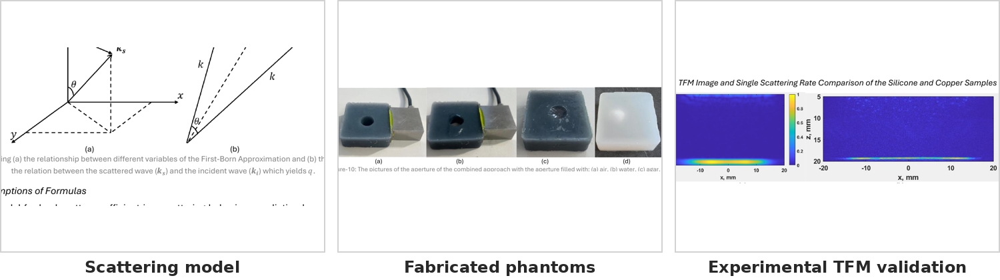
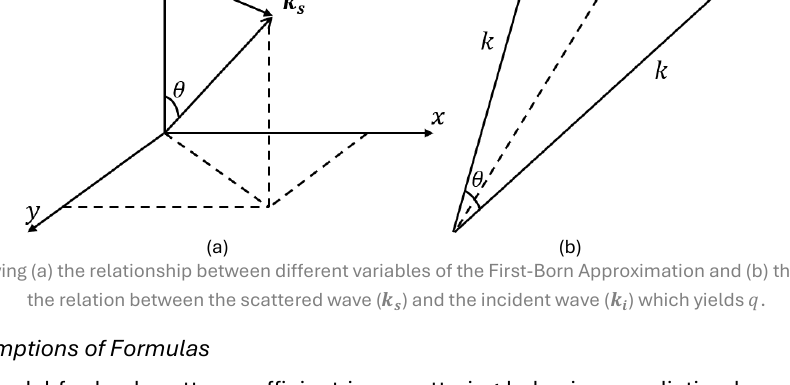
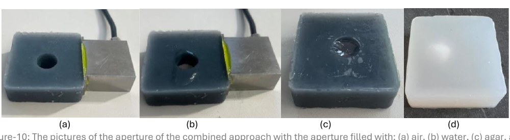
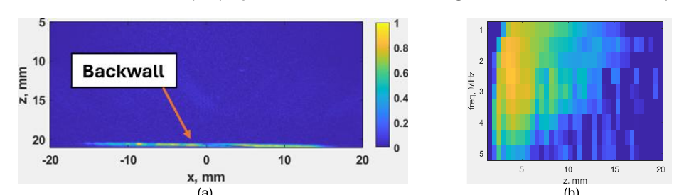
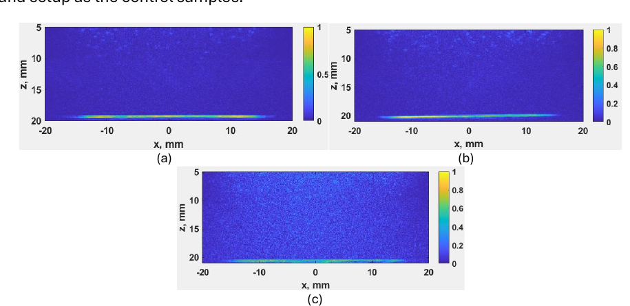
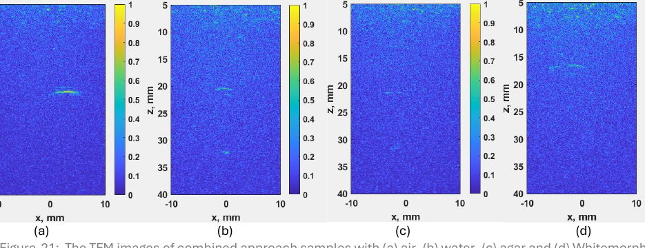
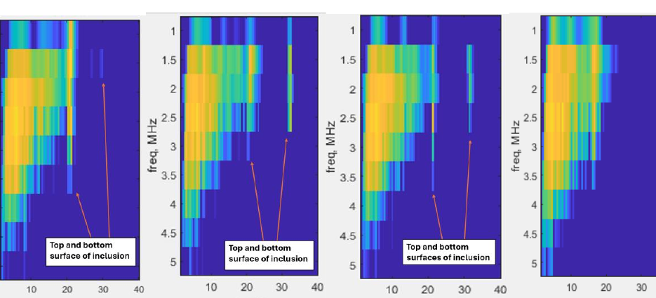
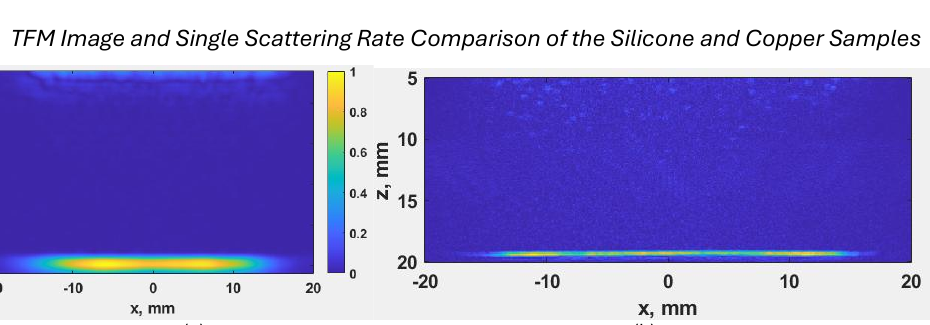
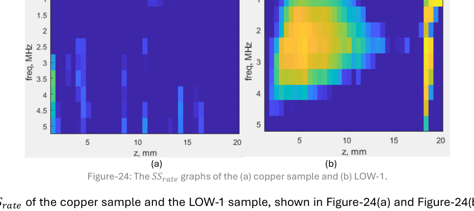
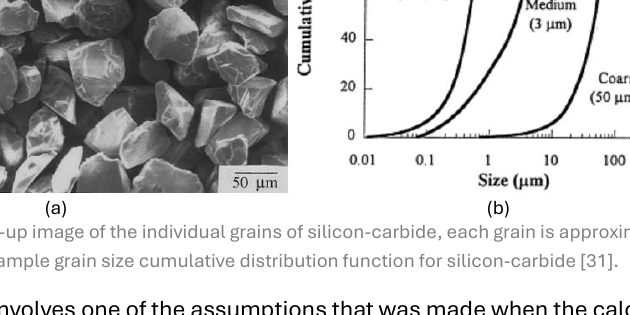

# Ultrasonic NDT of Highly Scattering Materials

**Physics-based design and experimental validation of silicone phantom samples for ultrasonic non-destructive testing (NDT).**

<p align="center">
  
</p>

This project investigates whether inexpensive, controllable silicone phantoms can reproduce the ultrasonic scattering behaviour of difficult-to-inspect materials. I combined analytical scattering models, Python-based sample-design calculations, physical phantom fabrication, phased-array ultrasonic testing, and image/data analysis to compare theoretical predictions against experiments.

The work was completed at the **University of Bristol** under the supervision of **Dr. Alexander Velichko**.

## What I did

I developed a workflow that connects material physics directly to an experimental NDT sample:

1. **Model single-particle ultrasonic scattering** using the First-Born approximation.
2. **Convert scattering amplitude into a target bulk backscatter coefficient** using Rose's model.
3. **Calculate particle number density, mass, and volume** required to fabricate a phantom with the desired scattering level.
4. **Fabricate silicone samples** with controlled scatterer concentrations and embedded inclusions.
5. **Acquire Full Matrix Capture (FMC) data** using a 2.5 MHz, 64-element phased-array probe.
6. **Evaluate the samples using Total Focusing Method (TFM) images and single-scattering-rate analysis**.
7. **Compare theory with experiment**, investigate disagreements, and identify improvements to the physical model and fabrication process.

The project therefore spans **physics-based modelling, numerical implementation, experimental design, ultrasonic NDT, signal/image interpretation, and model validation**.

---

## 1. Physics model

### First-Born approximation

For an isolated scatterer, I implemented the First-Born approximation for the scattering amplitude. The model accounts for:

- ultrasonic frequency and wave number,
- density contrast between the particle and host medium,
- Lamé-parameter / elastic-property contrast,
- particle radius and volume,
- scattering angle,
- and the particle form factor.

The normalized spherical form factor is

$$
F(q)=\frac{3[\sin(qa)-qa\cos(qa)]}{(qa)^3},
$$

with

$$
q=2k\sin\left(\frac{\theta}{2}\right), \qquad k=\frac{\omega}{c}.
$$

For the backscattering calculations used here, $\theta=\pi$.

<p align="center">
  
</p>

The implementation also handles the $qa\rightarrow0$ limit explicitly to avoid numerical division-by-zero issues.

### Rose's backscatter model

The scattering response of the complete phantom was designed using Rose's model:

$$
\eta = n |A|^2,
$$

where:

- $\eta$ is the target backscatter coefficient,
- $n$ is the number of scatterers per unit volume,
- $|A|^2$ is the squared single-particle scattering amplitude obtained from the First-Born calculation.

This provides the bridge between the **analytical particle model** and the **physical quantity of powder required for fabrication**.

### Modelling assumptions

The analytical model assumes approximately spherical particles, a homogeneous/isotropic host medium, weak material contrast, and operation in the Rayleigh-scattering regime. I explicitly examined these assumptions later when interpreting deviations between theory and experiment.

---

## 2. Python sample-design workflow

The Python scripts automate the calculations needed to move from material properties to a manufacturable sample.

### Computational pipeline

```text
Material + acoustic properties
          |
          v
First-Born scattering amplitude A
          |
          v
Target backscatter coefficient eta = n|A|^2
          |
          v
Required particle number density n
          |
          v
Particle count -> material volume -> material mass
          |
          v
75 mL silicone phantom recipe
```

The calculations include unit conversion for particle radius and density, spherical-particle volume, mass per particle, total particle count, and total material volume/mass for a specified sample volume.

### Repository files

| File | Purpose |
|---|---|
| `IRPCODE.py` | Integrated modelling script: spherical form factor, First-Born scattering amplitude, target $n$ range, and conversion to scatterer mass/volume. |
| `IRPCODE2.py` | Earlier integrated version of the same model and sample-design workflow. |
| `born_approx_final.py` | Modular implementation of the First-Born scattering-amplitude calculation using density and Lamé-parameter contrasts. |
| `particule_unit_vol_final.py` | Converts a target particle number density into the required scatterer mass and volume for a chosen sample volume. |
| `first-born-approximation.py` | Earlier exploratory formulation using Young's modulus and Poisson ratio to construct an effective stiffness contrast. |
| `particule-per-unit-volume.py` | Inverse calculation: derives particle number density from known scatterer mass, grain size, density, and sample volume. |

The repository retains the exploratory scripts as part of the development history; the modular `*_final.py` scripts and integrated `IRPCODE.py` represent the clearest versions of the calculation pipeline.

---

## 3. Experimental design

### Ultrasonic setup

All experimental NDT measurements used:

- **2.5 MHz** one-dimensional phased-array probe,
- **64 elements**,
- **0.50 mm pitch**,
- Full Matrix Capture (FMC),
- PeakNDT MicroPulse array controller,
- Sonatest Sonagel-W250 couplant.

The low test frequency was selected to keep the investigated particle sizes within the required scattering regime while retaining sufficient penetration through the samples.

FMC data were processed into **Total Focusing Method (TFM)** images. I also evaluated a **single scattering rate** ($SS_{rate}$) to quantify changes in scattering behaviour that were not always obvious from the TFM images alone.

> **Scope note:** the TFM and single-scattering-rate processing code used during the experimental study was laboratory code provided by Dr. Alexander Velichko. The Python code in this repository is my physics/scatterer modelling and sample-design work.

### Phantom fabrication

Samples were fabricated from CS25 condensation-cure silicone using a **100:5 silicone-to-catalyst mass ratio**. Each sample had a target volume of **75 mL**.

I investigated three scatterer series:

- **LOW:** larger silicon-carbide particles,
- **MID:** finer silicon-carbide particles,
- **COCO:** ultra-fine cocoa powder with particle concentrations matched to the MID series but substantially different material properties.

Each series contained multiple particle concentrations. This made it possible to separate the effect of **particle concentration** from the effect of **scatterer material properties and grain size**.

### Defect / inclusion phantoms

To test defect visibility, I also fabricated samples containing four deliberately introduced inclusions:

- air,
- water,
- agar,
- Whitemorph thermoplastic.

The inclusions were evaluated first in relatively transparent silicone and then in a scattering background.

<p align="center">
  
</p>

---

## 4. Baseline and controlled-scattering results

A scatterer-free silicone sample established the experimental baseline. The backwall is clearly visible in the TFM image and provides a consistent reference for comparisons between samples.

<p align="center">
  
</p>

For the **LOW** sample series, increasing the designed backscatter coefficient produced the expected behaviour:

- progressively stronger visible scattering noise,
- reduced backwall clarity,
- and a corresponding decline in single-scattering rate.

<p align="center">
  
</p>

This was an important validation that the analytical design approach could control scattering behaviour **within a sample family**.

---

## 5. Testing the model across different scatterers

A more demanding test was whether samples designed to have similar theoretical backscatter coefficients would also behave similarly when the particle size or material changed.

The results were more nuanced:

- The **LOW** series followed the expected trend cleanly.
- The **MID** silicon-carbide series showed much stronger noise and lower $SS_{rate}$ than expected, even when the target backscatter coefficient matched the LOW series.
- The **COCO** series used particle concentrations matched to MID but a material with very different properties. Its clearer TFM images and higher $SS_{rate}$ were qualitatively consistent with the First-Born/Rose framework.

This comparison showed that the model captured important dependencies on material properties, while also revealing that the fabrication/model assumptions were not sufficient for exact cross-material equivalence.

---

## 6. Defect detection in scattering media

The inclusion experiments tested a practical question: **can a defect remain detectable once realistic background scattering is introduced?**

When the inclusions were embedded in a scattering phantom, their visibility decreased significantly compared with the non-scattering controls, as expected. Nevertheless, the air, water, and agar inclusions still produced structured changes in the TFM and $SS_{rate}$ results.

<p align="center">
  
</p>

The single-scattering-rate maps provided complementary information to the TFM images, particularly around the inclusion surfaces and through the inclusion depth.

<p align="center">
  
</p>

Water and agar produced the clearest changes in the scattering-rate analysis. Whitemorph was less useful for this specific phantom configuration.

---

## 7. Comparison with a real polycrystalline material

As a final validation step, I compared one silicone phantom against a **polycrystalline copper sample with approximately 0.09 mm grain size**. The samples were selected to have matching theoretical backscatter coefficients at 2.5 MHz.

The TFM images were visually very similar:

<p align="center">
  
</p>

However, the corresponding single-scattering-rate maps were substantially different:

<p align="center">
  
</p>

This result is important because it shows both the **strength and the limitation** of matching only the backscatter coefficient: it can reproduce some observable image characteristics without guaranteeing identical higher-order scattering behaviour.

---

## 8. What the discrepancies revealed

Rather than treating the mismatches as failed experiments, I used them to identify limitations in both the fabrication process and the analytical assumptions.

### Microbubbles introduced during mixing

High concentrations of powder tended to clump during mixing and trap air. Even after the powder was dispersed, microbubbles remained in the silicone and introduced additional scattering not represented by Rose's model.

**Improvement:** vacuum-degas the mixture during or immediately after mixing.

### Real SiC grains are not spherical

The analytical form factor assumed perfectly spherical particles, but the actual silicon-carbide grains were visibly irregular.

<p align="center">
  
</p>

Because the predicted backscatter coefficient depends on the squared scattering amplitude, even moderate form-factor errors can propagate strongly into the calculated particle concentration.

**Improvement:** use a form factor that represents irregular particles and include the measured grain-size distribution rather than a single nominal radius.

### Experimental repeatability

Manual probe placement caused position variation between repeated measurements, especially for localized inclusions.

**Improvement:** automate probe/sample positioning so repeated FMC measurements are spatially registered.

---

## 9. Key outcomes

The project demonstrated that:

- silicone phantoms can be systematically tuned to create controlled levels of ultrasonic scattering;
- the First-Born approximation and Rose's model provide a useful physics-based starting point for designing those phantoms;
- theoretical backscatter coefficient tracks experimental behaviour well **within several controlled sample series**;
- material properties matter in addition to particle concentration;
- TFM imaging and single-scattering-rate analysis provide complementary views of the scattering behaviour;
- defects remain detectable in deliberately scattering phantoms, although visibility degrades as background scattering increases;
- matching a single bulk metric such as backscatter coefficient is not sufficient to guarantee complete equivalence with a real polycrystalline material;
- fabrication details such as trapped microbubbles, particle shape, and grain-size distribution can dominate deviations from idealized theory.

---

## 10. Skills demonstrated

This project required me to combine several areas rather than treating the modelling, coding, and experiments as separate tasks:

**Scientific computing:** Python, NumPy, numerical implementation of analytical equations, unit handling, parameter sweeps, and model-to-experiment calculations.

**Physics / engineering modelling:** wave scattering, acoustic impedance, elastic-property contrast, Rayleigh scattering assumptions, First-Born approximation, Rose's backscatter model, particle form factors.

**Ultrasonic NDT:** phased arrays, Full Matrix Capture, Total Focusing Method, coupling, backwall interpretation, scattering/noise analysis, defect visibility.

**Experimental research:** controlled sample fabrication, baseline design, variable isolation, repeat measurements, comparative validation, root-cause analysis of unexpected results.

**Research judgement:** identifying when a model works, when it does not, and tracing discrepancies to physically plausible assumptions rather than forcing agreement with theory.

---

## Running the modelling code

The scripts require Python and NumPy.

```bash
pip install numpy
python IRPCODE.py
```

The material properties, test frequency, grain radius, target backscatter range, density, and sample volume can be changed directly in the script to design a different phantom configuration.

For a modular workflow, the scattering calculation and mass/volume conversion can also be used independently through:

```bash
python born_approx_final.py
python particule_unit_vol_final.py
```

---

## Project context

**Project:** Non-Destructive Testing of Highly Scattering Materials  
**Author:** Kutadgu Gokalp Demirci  
**Institution:** University of Bristol  
**Supervisor:** Dr. Alexander Velichko  
**Year:** 2025
